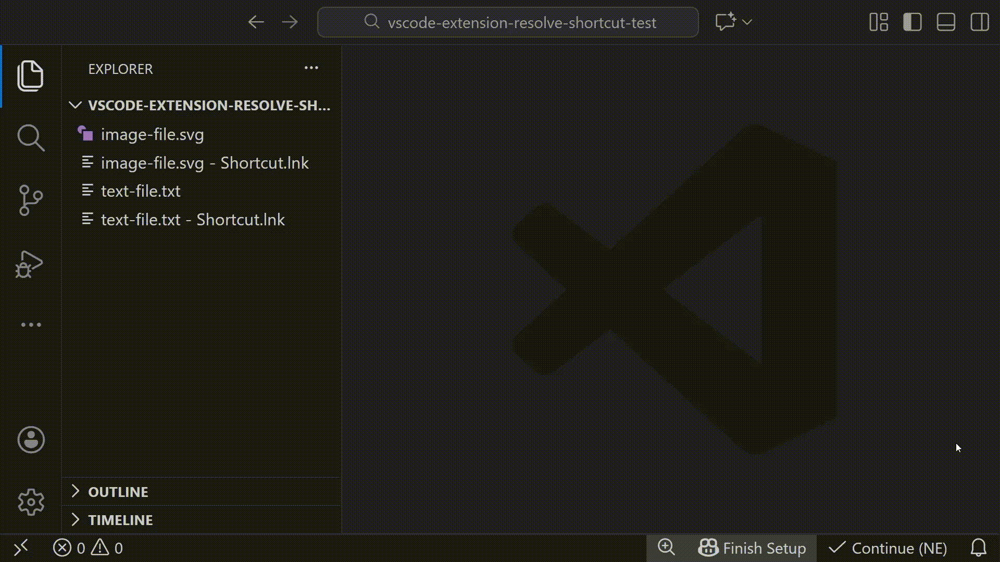

# Resolve Shortcut File

A VS Code extension that resolves Windows `.lnk` shortcut files and opens their target files or folders.



## Features

- **Resolve Shortcuts**: Automatically resolve `.lnk` Windows shortcut files to their target paths
- **Open Target**: Open the target file or folder with a single or double click
- **Consistent Behavior**: Single-click and double-click actions behave identically
- **Error Handling**: Clear error messages if shortcuts cannot be resolved

## Usage

### Via Click

- In the File Explorer, single-click or double-click a `.lnk` file and it will automatically resolve and open the target

## Requirements

- Windows OS (uses Windows COM objects to resolve shortcuts)
- VS Code 1.75.0 or later
- PowerShell 5.1 or later (included with Windows)

## Extension Settings

This extension currently has no user-configurable settings.

## Known Limitations

- Works only on Windows systems (uses Windows COM objects)
- Requires valid `.lnk` files (corrupted shortcuts cannot be resolved)
- The target file or folder must exist for successful opening

## Development

### Project Structure

```
src/
  ├── extension.ts           # Main extension entry point
  ├── shortcutResolver.ts    # Shortcut resolution logic
  └── test/
      ├── runTest.ts         # Test runner
      └── shortcutResolver.test.ts  # Unit tests
```

### Building

```bash
npm install
npm run compile
```

### Testing

```bash
npm test
```

#### Integration Tests

The project includes integration tests with real `.lnk` shortcut files:

1. **Unit Tests** (`src/test/shortcutResolver.test.ts`) - Tests file validation and error handling
2. **Integration Tests** (`src/test/integration.test.ts`) - Creates actual `.lnk` shortcuts and tests resolution

The integration tests automatically:
- Create a test target file
- Generate a real Windows `.lnk` shortcut using PowerShell COM objects
- Test shortcut resolution against the actual file
- Clean up test files after completion

#### Manual Testing with Test Fixtures

To create test shortcut files you can manually open and test, run:

```bash
scripts\setup-test-fixtures.bat
```

This creates test shortcuts in the `test-fixtures/` directory that you can use for manual testing.

### Debugging & Building

**Using F5 (Recommended):**
1. Press `F5` to compile, package, and install the extension
2. Test the extension in a new VS Code window that opens
3. Use the installed extension or test with `test-fixtures/test-shortcut.lnk`

**Manual Build Commands:**
```powershell
# Compile and package only (skip installation)
./build.ps1 -Install:$false

# Show help with all options
./build.ps1 -Help
```

## License

This project is released into the public domain under the [Unlicense](https://unlicense.org/).
You are free to use, modify, and distribute this software for any purpose without any restrictions.


